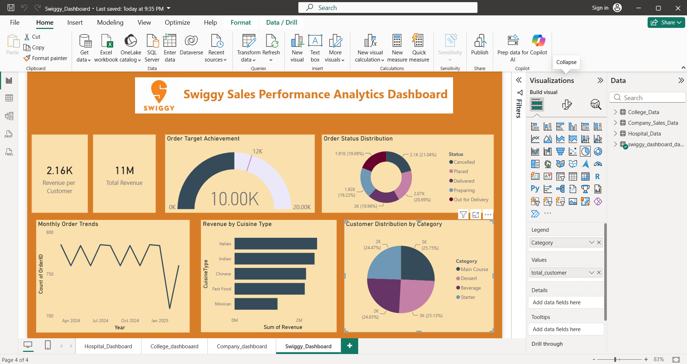

# 📊 Swiggy Sales Performance Analytics Dashboard

An interactive **Power BI dashboard** designed to analyze Swiggy sales data and transform raw business data into meaningful insights. This project demonstrates how Power BI can be used to visualize key performance indicators (KPIs), monitor sales trends, and support data-driven decision-making.

---

## 📸 Dashboard Preview

---

## 📖 Project Overview

The **Swiggy Sales Performance Analytics Dashboard** provides a comprehensive analysis of sales performance through interactive visualizations and business metrics. It helps identify revenue trends, customer behavior, order performance, and cuisine-wise sales distribution, enabling users to make informed business decisions.

---

## 🚀 Dashboard Features

- 💰 Total Revenue Analysis
- 👤 Revenue per Customer
- 🎯 Order Target Achievement
- 📦 Order Status Distribution
- 📈 Monthly Order Trends
- 🍽️ Revenue by Cuisine Type
- 👥 Customer Distribution by Category
- 📅 Interactive Month Filter

---

## 🛠️ Technologies Used

- Microsoft Power BI
- Power Query
- DAX (Data Analysis Expressions)
- Data Modeling
- Data Cleaning & Transformation
- Interactive Data Visualization

---

## 📊 Key Business Insights

- Analyzed overall sales performance.
- Monitored revenue generated per customer.
- Tracked order target achievement using KPIs.
- Identified monthly order trends.
- Compared revenue across different cuisine types.
- Analyzed customer distribution by food category.
- Visualized order status for operational insights.

---

## 📂 Dataset Information

The dashboard is built using a sales dataset containing:

- Order ID
- Customer ID
- Restaurant Name
- Category
- Cuisine Type
- Revenue
- Price
- Discount (%)
- Order Status
- Delivery Time
- Order Date
- Location

---

## 🎯 Learning Outcomes

Through this project, I gained practical experience in:

- Designing interactive Power BI dashboards
- Creating KPIs using DAX
- Data cleaning and transformation using Power Query
- Building data models
- Developing business-focused visualizations
- Applying Business Intelligence concepts
- Data storytelling through dashboards

---

## 👩‍💻 Author

**Anusha Seelam**

**B.Tech Student | Aspiring Data Scientist**

### Skills

- Python
- SQL
- Power BI
- Machine Learning
- Generative AI
- Data Analytics
